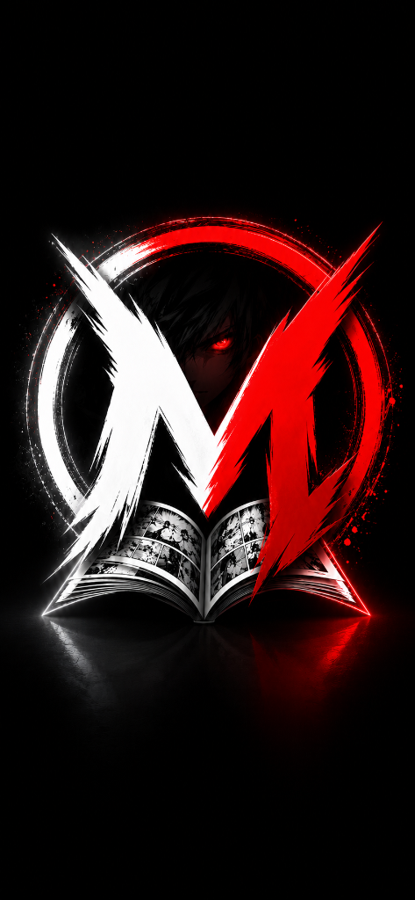

# MangaVerse

<p align="center">
  
</p>

<p align="center">
  <strong>A modern, open-source manga reader built for speed, beautiful design, and an exceptional reading experience.</strong>
</p>

<p align="center">
  
  
  
  
</p>

---

## About

**MangaVerse** is a fork of [Mihon](https://github.com/mihonapp/mihon) — the continuation of Tachiyomi — rebranded and customised by **Rana** (Founder & Lead Developer).

It retains the full power of the Mihon extension ecosystem while adding a premium visual identity: a dark red-and-black theme, a cinematic two-phase launch screen, a bespoke About page, and a streamlined experience with unnecessary upstream UI removed.

---

## Features

- Full Mihon extension support — access thousands of manga sources
- Custom red/black/white theme — premium Material 3 design language
- Cinematic splash screen — two-phase animated logo to text launch sequence
- Custom MangaVerse branding — logo, app icon, About screen, and more
- No donation popups — Support Us section removed for a clean experience
- All reading modes — paged, continuous, webtoon
- Library management — categories, tracking, downloads
- MangaDex + local source — works out of the box without extensions

---

## Tech Stack

| Layer | Technology |
|-------|-----------|
| Language | Kotlin |
| UI | Jetpack Compose + Material 3 |
| Navigation | Voyager |
| Networking | OkHttp + Retrofit |
| Image Loading | Coil |
| DI | Injekt |
| Database | SQLDelight |
| Build | Gradle (Kotlin DSL) |

---

## Getting Started

### Prerequisites

- Android Studio Hedgehog or newer
- JDK 17+
- Android SDK 26+

### Build

```bash
# Clone the repo
git clone https://github.com/your-username/MangaVerse.git
cd MangaVerse

# Build debug APK
./gradlew assembleDebug

# APK will be at:
# app/build/outputs/apk/debug/app-debug.apk
```

### Install

```bash
adb install app/build/outputs/apk/debug/app-debug.apk
```

---

## Project Structure

```
MangaVerse/
├── app/                          # Main application module
│   └── src/main/
│       ├── java/
│       │   ├── eu/kanade/        # Core app (Mihon base)
│       │   │   ├── presentation/ # Compose UI screens
│       │   │   └── tachiyomi/    # App logic, services
│       │   └── mihon/feature/    # Feature modules
│       └── res/
│           ├── drawable-nodpi/   # Splash artwork assets
│           └── values/           # Themes and strings
├── source-api/                   # Extension source API
├── domain/                       # Domain models and use cases
├── data/                         # Data layer (DB, network)
└── i18n/                         # Localisation resources
```

---

## Branding

MangaVerse uses a custom red x black x white palette:

| Token | Hex | Usage |
|-------|-----|-------|
| MvRed | #D32F2F | Accents, badges, icons |
| MvRedDim | #8B0000 | Gradients, shadows |
| MvBlack | #0A0A0A | Card backgrounds |
| MvWhite | #F5F5F5 | Primary text |

---

## Links

| | |
|--|--|
| GitHub | https://github.com/Rana0069 |
| Discord | https://discord.gg/FBaNYNS4AK |
| Email | ------------- |

---

## Developer

**Rana** — Founder & Lead Developer

---

## Credits and License

MangaVerse is based on **[Mihon](https://github.com/mihonapp/mihon)**, which is itself the continuation of **Tachiyomi**.

All original Mihon/Tachiyomi code is (c) their respective authors and contributors, licensed under the **Apache License 2.0**.

MangaVerse-specific modifications by Rana are also released under the **Apache License 2.0**.

See [LICENSE](LICENSE) for the full license text.

> MangaVerse is not affiliated with or endorsed by the Mihon team.
